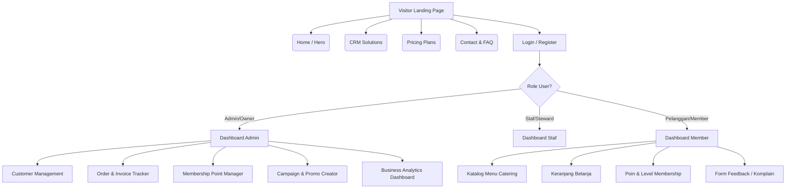
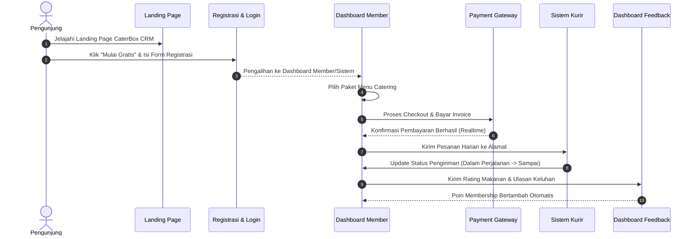
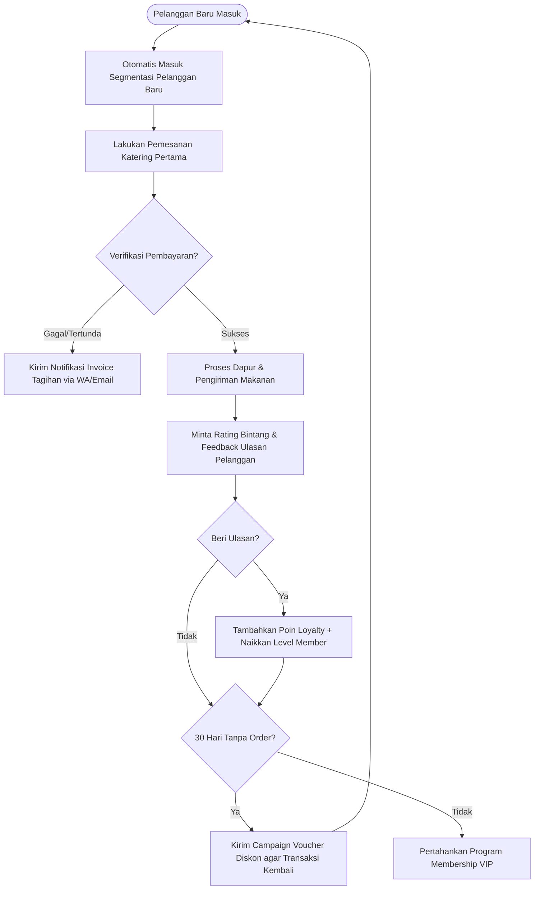

# DOKUMEN REQUIREMENT PRODUK (PRD) LENGKAP
## SISTEM CRM CATERBOX (VERSI EVOLUSI V1, V2, V3)

---

## DAFTAR ISI

- [BAB I — Executive Summary](#bab-i-—-executive-summary)
  - [1.1 Visi Produk](#11-visi-produk)
  - [1.2 Latar Belakang & Masalah](#12-latar-belakang--masalah)
  - [1.3 Tujuan Bisnis](#13-tujuan-bisnis)
- [BAB II — PRD V1 (Versi Dasar / MVP)](#bab-ii-—-prd-v1-versi-dasar--mvp)
  - [2.1 Sasaran Produk V1](#21-sasaran-produk-v1)
  - [2.2 Target Pengguna V1](#22-target-pengguna-v1)
  - [2.3 Struktur Landing Page V1](#23-struktur-landing-page-v1)
  - [2.4 Metrik Keberhasilan V1](#24-metrik-keberhasilan-v1)
- [BAB III — PRD V2 (Versi Menengah / Intermediate)](#bab-iii-—-prd-v2-versi-menengah--intermediate)
  - [3.1 Sasaran Bisnis & Persona Pengguna](#31-sasaran-bisnis--persona-pengguna)
  - [3.2 Struktur & Fitur Landing Page V2](#32-struktur--fitur-landing-page-v2)
  - [3.3 Fitur Inti CRM yang Ditampilkan](#33-fitur-inti-crm-yang-ditampilkan)
  - [3.4 Daftar Testimoni & FAQ (10 Item)](#34-daftar-testimoni--faq-10-item)
- [BAB IV — PRD V3 (Versi Lengkap / Complete SaaS)](#bab-iv-—-prd-v3-versi-lengkap--complete-saas)
  - [4.1 Visi & Integrasi Sistem](#41-visi--integrasi-sistem)
  - [4.2 Arsitektur Informasi & Spasi Mockup](#42-arsitektur-informasi--spasi-mockup)
  - [4.3 Spesifikasi Fitur CRM & Dashboard Preview](#43-spesifikasi-fitur-crm--dashboard-preview)
  - [4.4 Dashboard KPI Bisnis](#44-dashboard-kpi-bisnis)
- [DIAGRAM SISTEM & ALUR PENGGUNA](#diagram-sistem--alur-pengguna)
  - [Sitemap Diagram](#sitemap-diagram)
  - [User Flow Diagram](#user-flow-diagram)
  - [CRM Workflow Diagram](#crm-workflow-diagram)
- [LANDING PAGE COPYWRITING LENGKAP](#landing-page-copywriting-lengkap)

---

## BAB I — EXECUTIVE SUMMARY

### 1.1 Visi Produk
Menjadi platform Customer Relationship Management (CRM) berbasis SaaS khusus catering nomor satu yang membantu pengusaha catering mengotomasi operasional mereka, meningkatkan retensi pelanggan melalui loyalty program, serta menyajikan analitik bisnis berbasis data yang mendalam.

### 1.2 Latar Belakang & Masalah
Industri kuliner catering menghadapi tantangan unik dalam mempertahankan pelanggan korporasi maupun individu. Sebagian besar pengusaha catering mengelola data pesanan, langganan harian, membership point, dan promo menggunakan spreadsheet manual atau pesan instan. Masalah utamanya meliputi:
- **Pelacakan Manual yang Lambat**: Pencatatan data pesanan berulang rawan kesalahan.
- **Ketiadaan Hubungan yang Terstruktur**: Sulit memetakan pelanggan mana yang loyal dan kapan waktu terbaik memberikan promo.
- **Kesulitan Menangani Keluhan**: Riwayat keluhan pelanggan tidak terpusat, menyebabkan tingkat retensi yang rendah.

### 1.3 Tujuan Bisnis
- Mengakuisisi minimal 200 pemilik catering aktif dalam 6 bulan pertama.
- Membantu partner catering menaikkan retensi pelanggan (repeat orders) mereka sebesar 35%.
- Mengurangi waktu administrasi pemrosesan pesanan catering hingga 60% menggunakan dashboard otomatis.

---

## BAB II — PRD V1 (VERSI DASAR / MVP)

### 2.1 Sasaran Produk V1
Memperkenalkan konsep **CaterBox CRM** kepada usaha catering dan memicu minat pendaftaran akun uji coba gratis. Fokus utama adalah edukasi pasar mengenai pentingnya mendigitalisasi relasi pelanggan kuliner.

### 2.2 Target Pengguna V1
- **Pemilik Catering**: Mengawasi tren omzet bisnis.
- **Admin Catering**: Memproses pemesanan masuk harian.
- **Customer Individu / Korporat**: Memesan makanan secara berkala.

### 2.3 Struktur Landing Page V1
- **Navbar**: Logo CaterBox CRM, link menu standard (Home, Our Menu, About Us, Contact, Login).
- **Hero Section**: Headline yang menekankan kemudahan manajemen catering dengan subheadline penjelas dan CTA gratis (Mulai Gratis / Lihat Demo).
- **Features Section**: Menampilkan 4 pilar fitur dasar:
  - *Customer Management*
  - *Order Management*
  - *Membership Management*
  - *Payment Management*
- **Footer**: Kontak e-mail resmi, ikon sosial media, dan hak cipta.

### 2.4 Metrik Keberhasilan V1
- **Jumlah Pengunjung Unik (Unique Visitors)**: Target > 1,500/bulan.
- **Click-Through Rate (CTR) tombol CTA**: Target > 3%.
- **Bounce Rate**: Harus di bawah 65%.

---

## BAB III — PRD V2 (VERSI MENENGAH / INTERMEDIATE)

### 3.1 Sasaran Bisnis & Persona Pengguna
Meningkatkan konversi pendaftaran uji coba dan pemesanan sesi demo langsung.

#### Persona 1: Ibu Ratna (Pemilik Catering "Ratna Sedap")
- **Pain Points**: Data langganan harian acak-acakan di WhatsApp, sering lupa mengirim pesanan ke pelanggan yang sudah bayar bulanan.
- **Goals**: Memiliki satu dasbor terpusat untuk melihat status kiriman langganan harian pelanggan.

#### Persona 2: Budi (Admin Operasional Catering)
- **Pain Points**: Kewalahan merekap transaksi manual di Excel dan menghitung poin loyalti anggota secara manual.
- **Goals**: Pembayaran otomatis terverifikasi dan poin loyalti dihitung otomatis oleh sistem setelah pesanan diselesaikan.

#### Persona 3: Doni (Pelanggan Instansi Korporat)
- **Pain Points**: Tidak tahu apakah pesanannya hari ini sudah dikirim atau belum, dan bingung mengecek voucher diskon yang aktif.
- **Goals**: Mengakses pelacakan status pesanan real-time dan katalog poin membership.

### 3.2 Struktur & Fitur Landing Page V2
- **Sticky Navbar**: Dilengkapi tombol "Daftar" dan "Masuk" yang menempel saat scroll.
- **Dashboard Preview**: Mockup visual dasbor admin untuk meyakinkan calon pelanggan mengenai kualitas software.
- **Social Proof**: Statistik ringkasan data yang diakumulasikan sistem (Total Customers, Total Orders, Total Revenue, Active Members).
- **Problem & Solution Section**: Poin-poin masalah umum catering dan pemecahannya oleh CaterBox CRM.
- **Benefits Section**: Fokus pada efisiensi waktu, kenaikan omzet, dan penurunan churn-rate pelanggan.

### 3.3 Fitur Inti CRM yang Ditampilkan
1. **Customer CRM**: Profil pelanggan, riwayat pemesanan lengkap, segmentasi pelanggan (VIP, Reguler, Baru).
2. **Order Management**: Form pemesanan online, pelacakan pengantaran, riwayat pesanan pelanggan.
3. **Payment**: Integrasi status pembayaran invoice otomatis.
4. **Membership**: Tingkatan level keanggotaan (Bronze, Silver, Gold), kalkulator poin loyalti, dan penukaran hadiah.
5. **Campaign Promo**: Generator kode voucher diskon dan campaign e-mail/WA terarah.
6. **Feedback**: Rating makanan, ulasan teks, dan panel penanganan keluhan.
7. **Analytics**: Dasbor grafik visual pendapatan bulanan, analisis produk terlaris, laporan retensi pelanggan.
8. **Admin Management**: Hak akses bertingkat untuk admin, koki, kurir, beserta log aktivitas audit keamanan.

### 3.4 Daftar Testimoni & FAQ (10 Item)

#### Testimoni
- **Siska (Owner Delish Catering)**: *"Semenjak pakai CaterBox CRM, repeat order dari klien korporat kami naik 40%. Manajemen poin member membuat klien tidak mau pindah ke kompetitor!"*
- **Hendra (Manager Operasional Royal Bento)**: *"Fitur invoice otomatis dan WA notification sangat membantu. Admin tidak perlu lagi cek mutasi bank manual satu per satu."*
- **Dewi (Admin Dapur Bunda)**: *"Input pesanan mingguan pelanggan jadi jauh lebih cepat. Koki di dapur bisa langsung melihat rekap porsi harian otomatis."*

#### FAQ (10 Item Tanya-Jawab)
1. **Q**: Apa itu CaterBox CRM?
   **A**: CaterBox CRM adalah platform manajemen hubungan pelanggan (CRM) dan manajemen pesanan yang dirancang khusus untuk bisnis catering guna mengotomasi pesanan, pembayaran, membership, promosi, dan analitik bisnis.
2. **Q**: Apakah saya bisa mencoba CaterBox CRM secara gratis?
   **A**: Ya, kami menyediakan fasilitas uji coba gratis (Free Trial) selama 14 hari dengan akses fitur lengkap tanpa perlu memasukkan informasi kartu kredit.
3. **Q**: Bagaimana cara kerja fitur Membership dan Loyalty Points?
   **A**: Setiap pelanggan yang memesan akan otomatis mendapatkan poin berdasarkan nominal transaksi. Poin yang terkumpul dapat ditukar dengan voucher diskon atau menu gratis sesuai pengaturan yang ditentukan oleh pemilik catering di dashboard admin.
4. **Q**: Apakah sistem mendukung notifikasi otomatis?
   **A**: Ya, CaterBox CRM terintegrasi dengan WhatsApp and E-mail Gateway untuk mengirimkan konfirmasi pesanan, invoice, status pengiriman makanan, hingga voucher ulang tahun secara otomatis kepada pelanggan Anda.
5. **Q**: Bagaimana sistem pembayaran diproses?
   **A**: Kami mendukung integrasi Payment Gateway (Midtrans) sehingga pelanggan Anda dapat membayar menggunakan Transfer Bank, e-Wallet (Gopay, OVO, ShopeePay), atau Kartu Kredit. Status pembayaran akan otomatis terupdate di dashboard admin secara real-time.
6. **Q**: Apakah data pelanggan saya aman di CaterBox CRM?
   **A**: Sangat aman. Seluruh basis data dienkripsi dan disimpan menggunakan layanan cloud Supabase yang terjamin keamanannya dengan backup rutin harian.
7. **Q**: Apakah saya bisa mengatur akses yang berbeda untuk staf saya?
   **A**: Ya, terdapat fitur Role Management di mana pemilik catering dapat memberikan hak akses terbatas, misalnya hanya akses laporan untuk manajer, edit menu untuk koki, atau input pesanan untuk admin operasional.
8. **Q**: Apakah ada fitur pelacakan pengantaran kurir?
   **A**: Ya, kurir dapat menandai pesanan telah dikirim dan pelanggan akan mendapatkan tautan peta pelacakan status pengantaran secara instan.
9. **Q**: Bagaimana sistem membantu saya membuat promosi/campaign?
   **A**: Anda dapat mengelompokkan pelanggan berdasarkan riwayat belanja (misal: pelanggan pasif dalam 30 hari terakhir) dan mengirimkan kode voucher khusus langsung ke e-mail atau WhatsApp mereka dalam satu klik.
10. **Q**: Siapa yang bisa saya hubungi jika terjadi kendala teknis?
    **A**: Tim Customer Support kami siap membantu Anda 24/7 melalui chat WhatsApp interaktif di pojok kanan bawah landing page atau e-mail support@caterbox.com.

---

## BAB IV — PRD V3 (VERSI LENGKAP / COMPLETE SAAS)

### 4.1 Visi & Integrasi Sistem
Membangun ekosistem CRM end-to-end yang menyambungkan seluruh rantai interaksi pelanggan bisnis catering. Sistem ini memanfaatkan integrasi pihak ketiga untuk meningkatkan skalabilitas:
- **Supabase**: Penyimpanan basis data berkecepatan tinggi, otentikasi user, penyimpanan berkas gambar menu.
- **WhatsApp Notification API**: Pengiriman pesan notifikasi status pengiriman, pengingat tagihan langganan bulanan.
- **Midtrans Payment Gateway**: Pemrosesan pembayaran instan dengan notifikasi instan (Webhooks).
- **Google Maps API**: Perhitungan jarak pengiriman dan pencarian alamat pengiriman makanan pelanggan.
- **Google Calendar API**: Sinkronisasi jadwal pengiriman katering untuk acara pesta (wedding/event) ke kalender operasional dapur.

### 4.2 Arsitektur Informasi & Spasi Mockup
Struktur Landing Page disusun agar memaksimalkan rasio konversi pendaftaran dengan layout berikut:
- **Navigasi Atas (Sticky Navbar)**
- **Hero Banner Interaktif**: Headline, Deskripsi, Tombol Free Trial & Demo, dan Elemen Animasi Dashboard.
- **Statistik Key Indicators (Social Proof)**
- **Problem & Solution Section**: Menampilkan tantangan vs solusi kustom.
- **Interactive CRM Workflow Chart**: Diagram alur perjalanan transaksi.
- **Interactive Feature Classification Grid**: Klasifikasi fitur berdasarkan kategori strategis CRM.
- **Testimonial Slider (Carousel)**
- **Accordion FAQ**
- **Form Pendaftaran Free Trial & Booking Demo**
- **Newsletter & Footer**

### 4.3 Spesifikasi Fitur CRM & Dashboard Preview
Pada bagian Landing Page, akan ditampilkan **Dashboard Preview** interaktif yang memvisualisasikan data CRM riil, meliputi:
- **Total Customer**: Kuantitas total basis data pelanggan yang terdaftar.
- **Total Revenue**: Total omzet penjualan catering yang terproses.
- **Total Orders**: Total pesanan yang berhasil dilayani.
- **Active Membership**: Jumlah member terdaftar yang aktif mengumpulkan poin.
- **Produk Terlaris**: Visualisasi list makanan terpopuler (misal: Nasi Box Ayam Taliwang).
- **Recent Orders**: Log pesanan terbaru beserta status pembayaran dan pengirimannya.
- **Revenue Analytics**: Grafik area/garis tren omzet mingguan.
- **Customer Activities**: Feed log interaksi terupdate dari pelanggan (feedback masuk, pendaftaran member baru).

### 4.4 Dashboard KPI Bisnis
Metrik yang dipantau melalui dasbor analitik CRM terbagi dalam 4 kategori:

| Kategori | Nama Metrik KPI | Definisi & Tujuan |
| :--- | :--- | :--- |
| **Awareness** | Web Visitors | Memantau lalu lintas kunjungan calon pembeli ke landing page. |
| **Engagement** | Time on Page | Rata-rata durasi pengunjung membaca detail fitur di landing page. |
| **Conversion** | Trial Signups | Jumlah pengusaha catering yang mengonversi kunjungan menjadi registrasi trial gratis. |
| | Demo Bookings | Jumlah instansi/EO yang menjadwalkan sesi meeting demo produk. |
| **Business** | Customer Lifetime Value (CLV) | Estimasi nilai pendapatan rata-rata dari satu pelanggan sepanjang relasinya. |
| | Churn Rate | Persentase pelanggan katering yang berhenti berlangganan setiap bulannya. |
| | Repeat Order Rate | Rasio pemesanan kembali yang menunjukkan tingkat loyalitas pelanggan. |

---

## DIAGRAM SISTEM & ALUR PENGGUNA

### Sitemap Diagram

### User Flow Diagram

### CRM Workflow Diagram

---

## LANDING PAGE COPYWRITING LENGKAP

### 1. NAVIGASI (Navbar)
- **Brand**: 🍱 CaterBox CRM
- **Links**: Home | Solusi CRM | Harga Paket | Pertanyaan (FAQ) | Hubungi Kami
- **Button Utama**: Mulai Coba Gratis
- **Button Sekunder**: Masuk Staf

### 2. HERO SECTION
- **Headline**: "Kelola Bisnis Catering Lebih Praktis, Naikkan Omzet dengan CRM Modern"
- **Subheadline**: "Hentikan pencatatan pesanan manual. Kelola pelanggan, konfirmasi pembayaran otomatis, kirim notifikasi WhatsApp instan, dan kelola loyalty membership hanya dalam satu dasbor terintegrasi."
- **CTA Tombol Kiri**: Mulai Coba Gratis (14 Hari)
- **CTA Tombol Kanan**: Jadwalkan Demo Langsung

### 3. PROBLEM & SOLUTION SECTION
- **Masalah**: *"Kewalahan membalas chat pesanan katering, rekap pembayaran manual di mutasi bank, dan kebingungan melacak kurir pengirim makanan harian?"*
- **Solusi**: *"CaterBox CRM menyatukan seluruh saluran transaksi Anda. Pembayaran diverifikasi instan, database pelanggan rapi tersegmentasi, dan loyalty points berjalan otomatis untuk membuat pelanggan Anda ketagihan melakukan repeat order."*

### 4. DRAFT FITUR UTAMA
- **Operational CRM**: "Manajemen Menu Digital & Invoice Instan. Cetak label pengiriman otomatis lengkap dengan integrasi peta Google Maps untuk kurir."
- **Analytical CRM**: "Grafik Visual Pendapatan & Churn Rate Pelanggan. Pahami menu mana yang paling disukai pelanggan dan segmentasikan pelanggan pasif secara otomatis."
- **Collaborative CRM**: "Notifikasi WhatsApp Pembayaran & Notifikasi Dapur. Hubungkan tim admin, dapur, dan kurir dalam satu ekosistem komunikasi bebas hambatan."
- **Strategic CRM**: "Loyalty Points & Kampanye Voucher Spesial. Buat program member bertingkat (Silver, Gold) untuk mengunci loyalitas pelanggan Anda secara permanen."
